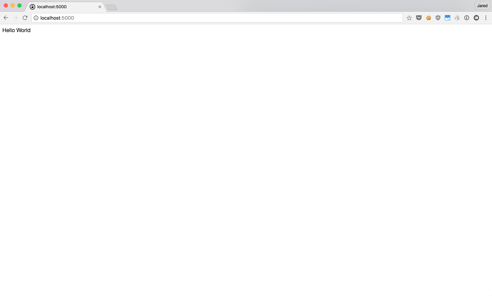
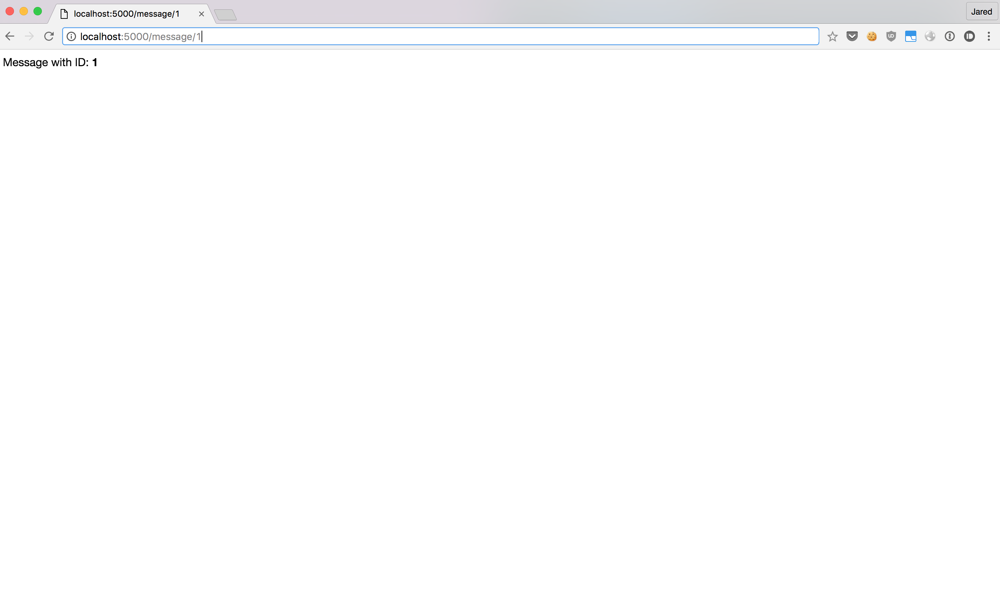
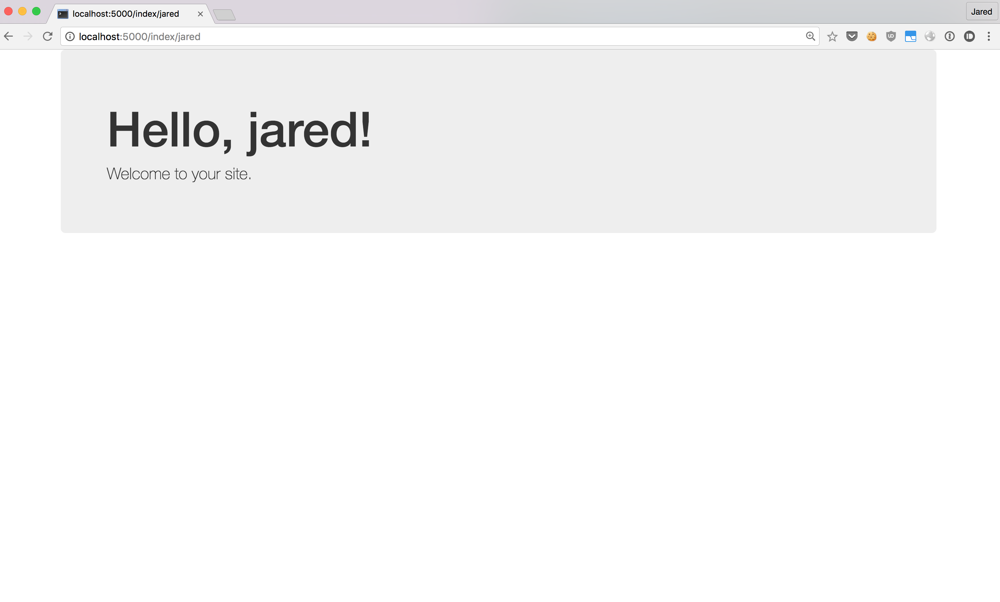
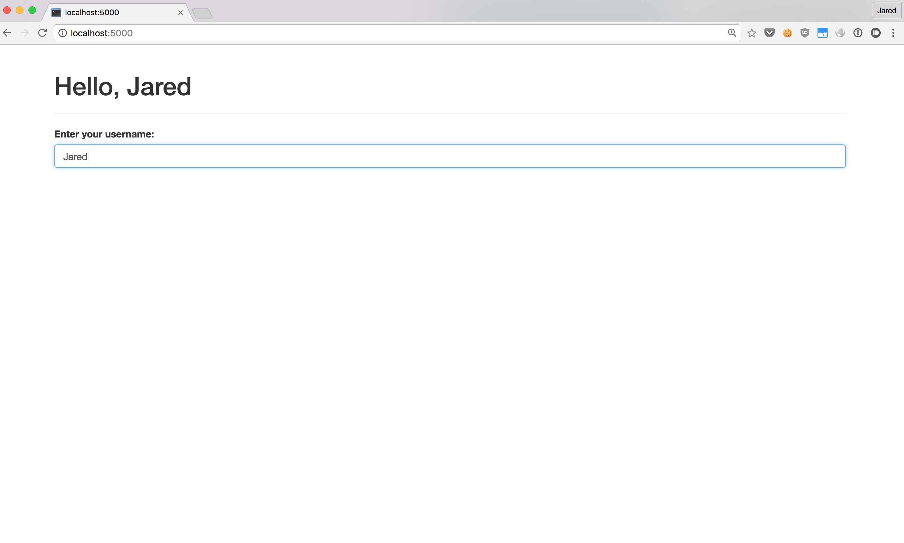

autoscale: true

## Web Development with Python and Flask
### Modern Web Apps Made Easy
#### Jared Smith

---

> Simple is better than complex.
- Tim Peters

---

# What is Flask?

- Server-side web micro-framework for Python
- Extremely well documented
- Runs on Python 2.X and 3.X
- Dependencies:
    - Werkzeug: routing, debugger, WSGI
    - Jinja2: templating

---

# Why Flask?

- Simple and understandable API
    - For example, you can use function decorators for routing
- Pick your poison
    - Choose the ORM (if any), caching frameworks, app layout, etc.
- It's scalable
    - Used by: Twilio, Uber, Pintrest, Mailgun, LinkedIn, and more

---

# Designed to be Extensible

- Missing:
    - Database Access
    - Web form validation
    - User authentication and authorization
    - Email support
    - Caching
    - Administration
- Have no fear!

---

# Adding On

- Database Access > SQLAlchemy
- Web Form Validation > WTFforms
- User Authentication and Authorization > Flask-Security
- Email Support > Flask-SMTP
- Caching > Flask-Cache
- Adminstration > Flask-Admin
- *and many more...*see [https://github.com/humiaozuzu/awesome-flask](https://github.com/humiaozuzu/awesome-flask)

---

# Making it Modular

- Flask lets you install only what you need without all the junk that other frameworks force on you


---

# Let's Install Flask!

- Linux and Mac

```
~ > virtualenv my_flask_app
~ > source my_flask_app/bin/activate
(my_flask_app) ~ > pip install flask
```

- Windows

```
C:\ > virtualenv my_flask_app
C:\ > my_flask_app/bin/activate
(my_flask_app) C:\ > pip install flask
```

---

# Keeping it Simple

1. Initialize and Configure App
2. Define routes and views as functions
3. Start the server

```python
from flask import Flask

app = Flask(__name__)

@app.route('/')
def index():
    return 'Hello World'

if __name__ == '__main__': 
    app.run(debug=True)
```

---

# Keeping it Simple

```
(my_flask_app) ~ > python hello.py
* Running on http://127.0.0.1:5000/ (Press CTRL+C to quit)
```




---

# Spicing it Up With Dynamic Routes

```python
from flask import Flask

app = Flask(__name__)

@app.route('/message/<uuid>')
def message(uuid):
    return 'Message with ID: <b>{}</b>'.format(uuid)
    
@app.route('/home/<name>')
def home(name):
    return "Welcome Home, <i>{}</i>".format(name)

if __name__ == '__main__': 
    app.run(debug=True)
```

---

# Spicing it Up With Dynamic Routes



---


# Templating

```python
from flask import Flask, render_template
app = Flask(__name__)

@app.route('/')
def index():
    return '<h1>Hello KnoxPy!</h1>'
    
@app.route('/index/<name>')
def hello(name):
    return render_template('index.html', name=name)
    
if __name__ == '__main__': 
    app.run(debug=True)

```

### templates/index.html

```html
<h1>Hello, {{ name }}!</h1>
```


---


# Adding Bootstrap

- Install Flask-Bootstrap

```
(my_flask_app) ~ > pip install flask-bootstrap
```


---

# Styling with Bootstrap

```python
from flask import Flask, render_template
from flask_bootstrap import Bootstrap

app = Flask(__name__)
bootstrap = Bootstrap(app)

@app.route('/index/<name>')
def hello(name):
    return render_template('index.html', name=name)
```

### templates/index.html

```html


<div class="container">
    <div class="jumbotron">
        <h1>Hello, {{ name }}!</h1>
        <p>Welcome to your site.</p>
    </div>
</div>

```

---

# Styling with Bootstrap



---

# Getting More Data

- Install WTForms

```
(my_flask_app) ~ > pip install flask-wtf
```

---

# Getting More Data

```python
import os

from flask import Flask, render_template
from flask_bootstrap import Bootstrap
from flask_wtf import Form
from wtforms import TextField
from wtforms.validators import Required

app = Flask(__name__)
app.config['SECRET_KEY'] = str(os.urandom(32))
bootstrap = Bootstrap(app)

class UsernameForm(Form):
    username = TextField('Enter your username:', validators=[Required()])
    
@app.route('/', methods=['GET', 'POST'])
def index():
    username = None
    form = UsernameForm()
    if form.validate_on_submit():
        username = form.username.data
        form.username.data = ''
    return render_template('index.html', form=form, username=username)
```

---

# Getting More Data

<br>
### templates/index.html
```html




<div class="container">
    <div class="page-header">
        
        <h1>Hello, {{ username }}</h1>
        
    </div>
    
    {{ wtf.quick_form(form) }}
</div>

```

---


# Forms




---


# Redirects and User Sessions

```python
from flask import Flask, render_template, redirect, url_for, session

# ...

@ app.route('/', methods=['GET', 'POST'])
def index():
    form = UsernameForm()
    if form.validate_on_submit():
        session['username'] = form.username.data
        form.username.data = ''
        return redirect(url_for('index'))
    return render_template('index.html', form=form, name=session.get('username'))
```


---

# Recommended App Structure (Simple)

```
root_folder/
    venv/
    my_flask_app/
        static/
        templates/
        __init__.py
        views.py
        models.py
        forms.py
        settings.py
        *.py
    tests/
    setup.py
    manage.py
    requirements.txt
```


---

# Recommended App Structure (Complex)

```
root_folder/
    venv/
    my_flask_app/
        public/
            __init__.py
            views.py
            models.py
            forms.py
            utils.py
        users/
            ...
        static/
        templates/
        __init__.py
        settings.py
        utils.py
    ...    
    requirements.txt
    requirements/
        dev.txt
        prod.txt
        test.txt
```


---


# Demo Time!

#### [https://github.com/jaredmichaelsmith/knoxpy-flask-web-dev](https://github.com/jaredmichaelsmith/knoxpy-flask-web-dev)


---

# Contact

- Website: [jaredmichaelsmith.com](jaredmichaelsmith.com)
- Blog: [blog.jaredmichaelsmith.com](blog.jaredmichaelsmith.com)
- Twitter: [@jaredthecoder](twitter.com/jaredthecoder)
- LinkedIn: [linkedin.com/in/jaredmichaelsmith](linkedin.com/in/jaredmichaelsmith)
- Email: [jared@jaredsmith.io](mailto:jared@jaredsmith.io)